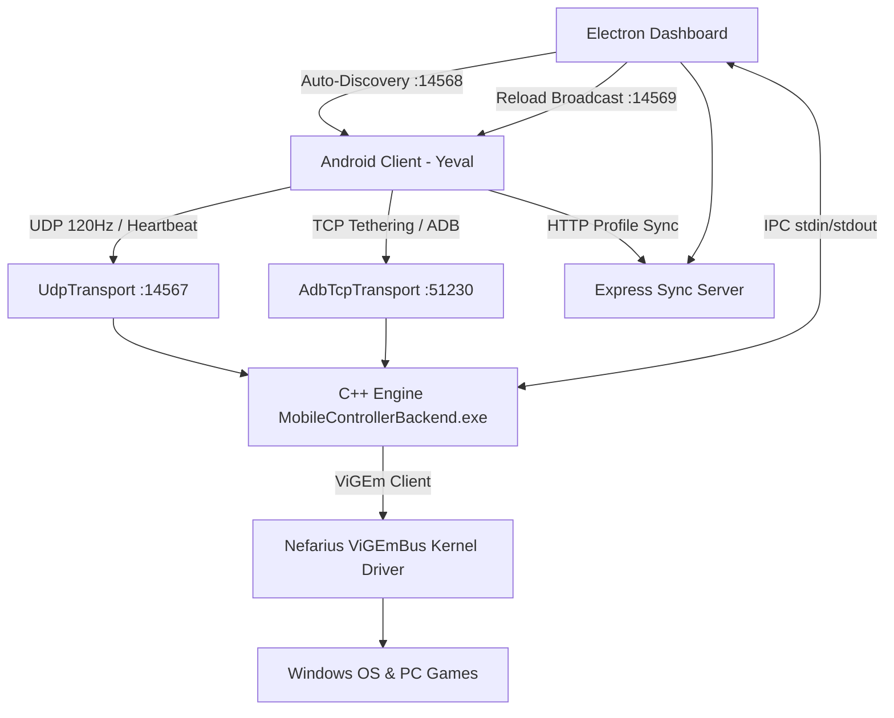

# Yeval: Mobile to PC Xbox Controller System

Yeval is an advanced, ultra-low latency, cross-platform system that turns your Android smartphone into a fully-functional virtual Xbox 360 controller for your Windows PC over Wi-Fi, USB Tethering, or USB Debugging (ADB).

Designed with multiplayer and couch co-op in mind, Yeval natively supports up to 4 simultaneous players and acts exactly like a traditional gaming console. It seamlessly manages connections, intelligently detects pre-existing physical controllers to prevent interference, and provides a sleek Glassmorphism desktop dashboard to configure custom layouts, touch zones, and player slot mappings in real time.

---

## Key Features

- **Dual-Transport Multi-Network Connectivity**:
  - **Wi-Fi (UDP)**: High-throughput, connectionless UDP streaming at up to 120Hz.
  - **USB Tethering (Ethernet/RNDIS)**: Ultra-low latency TCP streaming through physical USB tethering with multi-interface gateway isolation.
  - **USB Debugging (ADB)**: Near-zero latency TCP stream via automated ADB reverse port tunneling.
- **Multi-Interface Windows Gateway Bypass**:
  - The PC dashboard automatically binds to individual network adapters (Wi-Fi, Ethernet, Tethering) and replies to discovery broadcasts directly from the matching network interface, completely bypassing Windows default gateway conflicts when USB Tethering and Wi-Fi are active simultaneously.
- **Dynamic Failover & Live In-Game Reconnection**:
  - Seamlessly migrate across Wi-Fi and USB mid-game without Windows dropping your virtual controller slot or interrupting your gameplay.
  - Active background rediscovery ensures hotplugged connections connect automatically without requiring you to exit the controller screen.
- **True 4-Player Multiplayer & Drag-and-Drop Slot Reordering**:
  - Supports up to 4 concurrent smartphones connecting to Slots 1 through 4 (Player 1 to Player 4).
  - The PC Dashboard allows you to drag-and-drop or swap connected devices between player slots on the fly with immediate ViGEm remapping and live layout push.
- **Smart XInput Detection & Slot Persistence**:
  - On startup, the C++ Engine actively probes Windows XInput (slots 0–3) to detect physical Xbox controllers or virtual controllers (e.g. Steam Input), locking those slots to prevent player index collisions.
  - **Watchdog Preservation**: If network communication drops, the backend zeroes inputs after 300ms to stop player movement while keeping the virtual controller plugged into Windows so your game doesn't drop the player.
- **Calibrated Ergonomic Layouts & Touch Zone Engine**:
  - **Button Mode**: Calibrated physical layout matching Xbox controller proportions (Triggers/Bumpers $230\times 92\text{dp}$, D-Pad $168\times 168\text{dp}$, Face Buttons $92\times 92\text{dp}$, Meta Buttons $56\times 56\text{dp}$, Sticks $208\times 208\text{dp}$ base / $125\text{dp}$ knob).
  - **Zone Mode (Curved vs. Straight)**: 15 custom ergonomic polygonal zones with dynamic quadratic Bézier corner fillets and $4\text{px}$ insets in Curved mode, or crisp geometric polygons in Straight mode.
  - **Planar Geometric Auto-Fill**: Dashboard Zone Editor uses an exact planar graph subdivision engine to auto-fill empty canvas regions. By intersecting boundary edges of surrounding zones and the canvas frame, newly filled zones conform perfectly to adjacent polygon walls without blocky grid staircases or multi-island fragmentation.
  - **Live Mode Synchronization**: Toggling Curved/Straight mode on PC immediately broadcasts `YEVAL_RELOAD:<slotId>` to connected phones, updating screens in real time.
- **Right Stick Touchpad & Windows Mouse System**:
  - **Standard Stick (Button Mode)**: Right stick in Button mode always functions as a standard 360° analog thumbstick with physical deflection.
  - **Aim Mode (Camera Trackpad - Zone Mode)**: Transient swipe-to-aim with momentum decay for camera control without sticky spinning; thumbstick remains visually stationary as a clean touchpad.
  - **Cursor Mode (Desktop Mouse - Zone Mode)**: Controls actual Windows desktop cursor via Windows `SendInput` (`FLAG_MOUSE_EVENT`) with instantaneous delta consumption and quick-tap left click.
- **Dynamic Response Curves & Trigger Modulation**:
  - **Curves**: Switch between **Linear** (1:1 distance) and **Dynamic** (speed-accelerated aiming) response curves (active in Aim & Cursor modes).
  - **Triggers**: Modulate triggers via **Digital** (instant click actuation) or **Analog** (progressive slide modulation from 13 to 255).
- **Re-engineered Button Haptics & Force Feedback**:
  - **Down-Transition Micro-Ticks**: Crisp single micro-haptic click on initial button press or sliding into a new zone/D-pad direction, eliminating continuous buzzing during button holds.
  - **Analog Modulation Feedback**: Subtle actuation tick upon sliding past the trigger deadzone (`pressure > 25`), and firm bottom-out pulse at 100% full pull (`pressure = 255`).
  - **Continuous Rumble Engine**: Windows ViGEm motor vibration telemetry transmitted to smartphones in real time, driving gapless repeating waveform effects with zero PWM stutter.
- **In-Game Floating HUD & Dynamic Island**:
  - **Top Dynamic Island**: Switch between PC mode layout and local offline profile slots mid-game with live reactive highlighting and smooth horizontal scrolling.
  - **Right Quick Settings Pill**: Instant on-the-fly toggles for Right Stick Mode (Stick/Aim/Cursor), Trackpad Curve (Linear/Dynamic), and Triggers (Digital/Analog) with 1.5s HUD toast feedback. Gated to display stick and curve toggles only when in Zone Mode.
  - **Left Sensitivity Slab HUD**: 10-level vertical power bar for cursor speed adjustment in Cursor mode with touch-drag scrubbing and haptic feedback.
- **Interactive Mobile Home Screen & User Guide**:
  - **Device Carousel**: Swipeable PC discovery cards with real-time Wi-Fi/USB status indicators, battery levels, active slot counter, and per-device Preferred Profile dropdown selector.
  - **Expandable Help & Guide**: Built-in visual guide covering connection methods, Button vs. Zone layouts, HUD pills, profile management, and settings explanations.
- **Adaptive Power Efficiency**:
  - Automatically scales transmission rate from 120Hz down to 30Hz when the screen is idle for >500ms, yielding up to 75% battery savings in menus.
  - Displays real-time battery levels for both PC and connected smartphones.

---

## Architecture Overview



### 1. C++ Backend Engine (`MobileControllerBackend.exe`)
- Built on top of the **Nefarius ViGEmBus** kernel driver.
- Manages virtual Xbox 360 controller lifecycle (Connect, Disconnect, Input Update).
- Multiplexes inputs across dynamic UDP and TCP transport layers via the `ITransport` abstraction.
- High-precision `QueryPerformanceCounter` watchdog for 300ms idle input zeroing and 5s disconnect detection.
- Handles IPC commands (`MOVE`, `SWAP`, `RELOAD_DEVICE`, `KICK`, `TOGGLE`).

### 2. Electron Node.js Dashboard
- User interface built with HTML5, Vanilla CSS Glassmorphism, and Electron.
- Multi-interface UDP Auto-Discovery server scanning ports `14568–14578`.
- Embedded Express HTTP sync server serving slot layouts (`/profiles/slot-X.json`) and API reload hooks.
- Automated ADB reverse port management (`adb reverse tcp:8080 tcp:<dynamicHttpPort>` and `adb reverse tcp:14569 tcp:<dynamicTcpPort>`).
- Interactive Layout and Zone Editor with Planar Geometric Auto-Fill.
- Controls backend process lifecycle and routes IPC commands via `stdin`/`stdout`.

### 3. Android Client (Kotlin)
- Native Canvas rendering for ultra-low rendering latency (no WebViews).
- Multi-network socket factory binding (`Network.bindSocket()` and `socketFactory`) to route packets across physical Wi-Fi or USB tether interfaces.
- Binary Little-Endian 61-byte packet encoding with hardware sensor telemetry (gyroscope/accelerometer).
- Background profile caching (`latestPcProfile`) with mode-sensitive UI updates, schema migration versioning, and local profile management.

---

## Installation & Setup

### Prerequisites
- **Operating System**: Windows 10 or Windows 11 (64-bit).
- **ViGEmBus Driver**: Install the official [Nefarius ViGEmBus Driver](https://github.com/nefarius/ViGEmBus/releases).
- **Build Tools**: Visual Studio 2022 / 2026 (with *Desktop development with C++*) and CMake.
- **Node.js**: v18+ and npm.
- **Android Device**: Android 8.0+ (API 26+) with USB debugging or Wi-Fi connectivity.

### Building the C++ Engine
1. Navigate to the `windows/` directory.
2. Generate build files and compile:
   ```cmd
   cmake -B build -S .
   cmake --build build --config Release
   ```
3. The compiled binary will be located at `windows/build/Release/MobileControllerBackend.exe`.

### Starting the Dashboard
1. Navigate to the `dashboard/` directory.
2. Install dependencies:
   ```cmd
   npm install
   ```
3. Launch the dashboard:
   ```cmd
   npm start
   ```

### Running the Android App
1. Open the `android/` directory in Android Studio.
2. Build and install the APK to your Android device via USB or Android Studio Run.

---

## Usage Guide

1. **Start the Dashboard**: Launch the Yeval PC dashboard. The dashboard automatically spawns the C++ backend and initializes auto-discovery.
2. **Connect your Phone**:
   - **Wi-Fi**: Connect PC and phone to the same Wi-Fi network.
   - **USB Tethering**: Connect phone via USB cable and enable *USB Tethering* in Android settings.
   - **USB Debugging**: Connect phone via USB with *USB Debugging* enabled.
3. **Open Mobile App**: Tap your PC card to launch the controller.
4. **Customizing Profiles & Slots**:
   - Use the **Player Slots** tab on the PC dashboard to select layouts (Button mode vs. Zone mode) for Player 1–4.
   - Use the **Layout Editor** tab to design custom button placements, scale buttons (40%–160%), and create custom straight or curved touch zones with planar auto-fill.
   - Use the in-game **Top Dynamic Island** or **Menu Button** on the mobile screen to switch between PC Mode and local offline profile slots on the fly.
