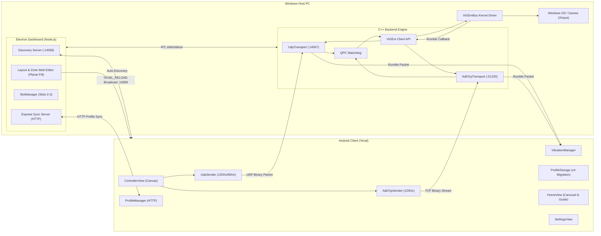

# Software Requirements Specification (SRS) for Yeval

## 1. Introduction

### 1.1 Purpose
This Software Requirements Specification (SRS) document details the complete functional, non-functional, and technical architectural requirements for the Yeval system. It defines the formal interfaces, binary communication protocols, operating system driver interactions, and network synchronization mechanisms used across the Windows PC server and Android client components.

### 1.2 Scope
Yeval is a real-time, low-latency mobile-to-PC input emulation platform. It allows up to 4 Android smartphones to concurrently emulate physical Xbox 360 controllers on a Windows PC. The platform is composed of:
1. **Windows C++ Native Backend**: Interfaces with the Windows kernel via the Nefarius ViGEmBus driver to inject emulated XInput controller states and process high-frequency input streams.
2. **Windows Electron Dashboard**: Manages auto-discovery, network gateway isolation, ADB reverse tunnels, dynamic layout generation, planar geometric zone auto-fill, and inter-process communication (IPC).
3. **Android Client Application**: High-performance native Kotlin app that renders customizable button/zone touch interfaces, gathers touch and motion telemetry, provides an interactive user guide, and dynamically multiplexes state over Wi-Fi (UDP), USB Tethering (TCP/Ethernet), and USB Debugging (ADB TCP).

---

## 2. System Architecture



### 2.1 Core Dependencies & Requirements
- **Host OS**: Windows 10 or Windows 11 (64-bit).
- **Driver**: Nefarius ViGEmBus Kernel Driver v1.17.x or higher.
- **Client OS**: Android 8.0 (API Level 26) or higher.
- **Build Toolchains**: Visual Studio 2022/2026 (MSVC x64), CMake 3.20+, Node.js v18+, Android Gradle Plugin 8.x.

---

## 3. Communication Protocols & Network Specifications

### 3.1 UDP Auto-Discovery Protocol
To connect without manual IP entry, the system uses a dual-way UDP beacon protocol:
- **Port Range**: `14568–14578` (Dashboard checks sequentially and binds to the first available port).
- **Client Broadcast**: The Android app sends an ASCII string `YEVAL_CLIENT` to port `14568` on broadcast (`255.255.255.255`) and subnet broadcast (`192.168.x.255`).
- **Server Response**: The PC Dashboard responds with:
  ```
  YEVAL_SERVER:<hostname>:<battery_percent>:<active_slots>/4:<dynamicUdpPort>:<dynamicHttpPort>:<dynamicTcpPort>:<serverId>
  ```
- **Shutdown Notification**: On closing the dashboard, the PC broadcasts `YEVAL_SHUTDOWN:<serverId>` to notify mobile clients immediately.
- **Reload Broadcast**: When profiles or curved/straight zone modes are updated on PC, the dashboard broadcasts `YEVAL_RELOAD:<slotId>` across UDP port `14569`, prompting connected clients to update their active layout in real time.

### 3.2 Multi-Interface Socket Pool & Windows Gateway Bypass
When USB Tethering is enabled simultaneously with Wi-Fi, Windows creates an active default gateway on the USB RNDIS adapter, which can misroute outbound UDP discovery packets.
- **Implementation**: The dashboard maintains a pool of interface-specific UDP sockets (`interfaceSockets`) bound to individual IPv4 adapter addresses (`192.168.1.x`, `10.x.x.x`, `127.0.0.1`).
- **Targeted Replies**: When a `YEVAL_CLIENT` packet arrives from a specific subnet, the reply is emitted directly from the matching adapter socket, completely bypassing Windows gateway routing conflicts.

### 3.3 Binary Controller Protocol (`0x4D435031`)
State packets are packed using 61-byte fixed Little-Endian binary frames:

| Offset | Field | Type | Description |
|---|---|---|---|
| `0x00` | `magic` | `uint32_t` | Magic identifier: `0x4D435031` (`'MCP1'`) |
| `0x04` | `version` | `uint8_t` | Protocol version (`1`) |
| `0x05` | `sequence` | `uint32_t` | Monotonically increasing sequence number per transport |
| `0x09` | `deviceId` | `uint32_t` | Unique device identifier (persisted per installation) |
| `0x0D` | `timestamp` | `uint64_t` | UNIX timestamp in milliseconds |
| `0x15` | `buttons` | `uint16_t` | XInput button bitmask (A, B, X, Y, D-pad, LB, RB, etc.) |
| `0x17` | `leftTrigger` | `uint8_t` | Analog trigger (0–255) |
| `0x18` | `rightTrigger`| `uint8_t` | Analog trigger (0–255) |
| `0x19` | `leftStickX` | `int16_t` | Analog stick X (-32768 to 32767) |
| `0x1B` | `leftStickY` | `int16_t` | Analog stick Y (-32768 to 32767) |
| `0x1D` | `rightStickX`| `int16_t` | Analog stick X (-32768 to 32767) |
| `0x1F` | `rightStickY`| `int16_t` | Analog stick Y (-32768 to 32767) |
| `0x21` | `gyroX` | `float` | Gyroscope angular velocity X |
| `0x25` | `gyroY` | `float` | Gyroscope angular velocity Y |
| `0x29` | `gyroZ` | `float` | Gyroscope angular velocity Z |
| `0x2D` | `accelX` | `float` | Accelerometer X |
| `0x31` | `accelY` | `float` | Accelerometer Y |
| `0x35` | `accelZ` | `float` | Accelerometer Z |
| `0x39` | `flags` | `uint32_t` | Bits 0–7: Battery percentage (0–100)<br>Bit 16 (`0x00010000`): `FLAG_MOUSE_EVENT` (packet.rightStickX/Y treated as mouse delta)<br>Bit 17 (`0x00020000`): `FLAG_MOUSE_LEFT_DOWN` (mouse left click)<br>Bit 18 (`0x00040000`): `FLAG_MOUSE_RIGHT_DOWN` (mouse right click) |

### 3.4 Force Feedback (Rumble) Protocol
- **ViGEm Notification**: Games submit motor vibration updates via XInput to ViGEm.
- **Backend Relay**: The C++ backend captures `largeMotor` (low-frequency) and `smallMotor` (high-frequency) values (0–255).
- **Packet Format**: `RUMB<largeMotorByte><smallMotorByte>` (6 bytes).
- **Transport**:
  - Over UDP: Emitted to mobile port `14570`.
  - Over TCP: Pushed through the existing TCP stream.
- **Mobile Gapless Execution**: Handled by `VibrationManager.kt` via repeating single-waveform `VibrationEffect` with zero PWM gap/silence time, with automatic UI haptic suppression during active gameplay rumble.

---

## 4. C++ Backend Specifications (`MobileControllerBackend.exe`)

### 4.1 Smart XInput Collision Detection
1. At launch, the backend executes `XInputGetState` across indices `0` through `3`.
2. Any slot returning `ERROR_SUCCESS` is marked as occupied by a physical controller or system device.
3. The engine logs: `[Main] System occupies XInput slot <index>`.
4. Only remaining unoccupied slots are created as virtual targets via `vigem_target_x360_alloc`.

### 4.2 Transport Multiplexing & Failover State Machine
- **Session Mapping**: Sessions are keyed by `deviceId`.
- **Dual-Send Transmission**:
  - Primary transport (e.g. USB ADB/Tether) transmits at 120Hz.
  - Secondary transport (Wi-Fi UDP) transmits a heartbeat packet every 80ms (`loopCount % 10 == 5`).
- **Transport Promotion**: If the active transport has no packets for >50ms, incoming packets on the secondary transport promote it to active status with zero frame drops.
- **Disconnection Handling**: On explicit transport drop, `lastPacketMsByTransport[droppedIndex]` is zeroed immediately, available transports are recalculated, and the controller is migrated to the active fallback.

### 4.3 High-Precision Watchdog
- Continuously evaluates arrival timestamps using Windows `QueryPerformanceCounter` (QPC).
- **Input Zeroing**: If silence exceeds `300ms`, a neutral packet is submitted to ViGEm to release all pressed buttons and center analog sticks, preventing runaway inputs.
- **Slot Retention**: The virtual controller remains plugged into the OS during temporary network silence.
- **Hard Timeout**: If silence exceeds `5000ms`, the session is terminated and the virtual target is disconnected.

### 4.4 Desktop Mouse Integration (`SendInput`)
- When receiving a packet with `FLAG_MOUSE_EVENT` (`0x00010000`):
  - Backend translates `packet.rightStickX` and `packet.rightStickY` into relative mouse coordinates via Windows `SendInput` (`MOUSEEVENTF_MOVE`).
  - Processes `FLAG_MOUSE_LEFT_DOWN` and `FLAG_MOUSE_RIGHT_DOWN` with stateful `MOUSEEVENTF_LEFTDOWN` / `MOUSEEVENTF_LEFTUP` tracking.
  - Passes neutral right-stick coordinates `(0, 0)` to ViGEm to ensure game cameras do not spin while desktop cursor movement is active.

### 4.5 IPC Command Interface (stdin / stdout)
The backend responds to newline-delimited text commands from the dashboard:
- `MOVE <ip|wifiIp|deviceId> <slot>`: Moves a session to a new virtual XInput slot.
- `SWAP <ip1> <slot1> <ip2> <slot2>`: Atomically swaps two sessions across virtual slots.
- `RELOAD_DEVICE <deviceId> <slotId>`: Emits `YEVAL_RELOAD:<slotId>` (UDP :14569) or `RELO:<slotId>` (TCP) to trigger layout refresh.
- `KICK <ip>`: Disconnects the target session.
- `TOGGLE <wifi|usb> <1|0>`: Enables or disables the specified transport layer at runtime.

---

## 5. Dashboard & Profile Management Specifications

### 5.1 Slot Management & Default Profile Calibration
- Manages 4 persistent player slots (Slots 0 to 3, corresponding to Player 1 to 4).
- Standardized calibrated Delta profile structure across PC and mobile:
  - Base button dimensions: Triggers/Bumpers $230\times 92\text{dp}$, D-Pad $168\times 168\text{dp}$, Face Buttons $92\times 92\text{dp}$, Meta Buttons $56\times 56\text{dp}$, Sticks $208\times 208\text{dp}$ base / $125\text{dp}$ knob.
  - 15 ergonomic polygonal zones matching authentic non-neon Xbox palette (A: Green `#10b981`, B: Red `#ef4444`, X: Blue `#3b82f6`, Y: Amber `#f59e0b`).
- Web Layout Editor supports full slider range calibration (40% min, 160% max, 100% calibrated midpoint).

### 5.2 Dynamic Straight vs. Curved Zone Engine
- **Curved Mode (`curveZones = true`)**: Generates quadratic Bézier corner fillets between adjacent edges with uniform $4\text{px}$ insets toward centroid.
- **Straight Mode (`curveZones = false`)**: Renders linear geometric polygons.
- **Instant Live Push**: Toggling curved/straight mode on the PC canvas immediately saves the profile and triggers `pushProfileToSlot(slotIndex)` to broadcast `YEVAL_RELOAD:<slotId>` to mobile clients.

### 5.3 Planar Geometric Boundary Auto-Fill Engine
The Zone Editor features an exact planar subdivision auto-fill algorithm:
1. **Segment Extraction & Intersection**: Gathers boundary segments from all existing zones and the canvas rectangle `[0, 0, 1000, 450]`, finding all intersection and endpoint contact points to produce atomic non-overlapping line segments.
2. **Planar Graph Topology**: Constructs a planar half-edge graph where each vertex maintains an angularly sorted adjacency list.
3. **Face Cycle Traversal**: Identifies all bounded planar faces and tests each for occupancy against existing zones.
4. **Target Region Flood-Fill**: Locates the unoccupied face containing the click position, merging connected empty faces across non-wall internal lines.
5. **Perimeter Tracing & Collinear Simplification**: Traces the continuous outer boundary of the empty space, perfectly adopting the outer walls of surrounding zones with zero blocky grid staircases and zero multi-island fragmentation.

### 5.4 Automated Reverse Tunneling
- For ADB connections, the dashboard continuously maintains reverse port forwarding:
  ```cmd
  adb reverse tcp:8080 tcp:<dynamicHttpPort>
  adb reverse tcp:14569 tcp:<dynamicTcpPort>
  ```
  Allowing the phone to query `http://127.0.0.1:8080` transparently over USB.

---

## 6. Android Client Specifications

### 6.1 Native Graphics & Input Pipeline
- Custom `ControllerView` extending native Android `View` using hardware-accelerated Canvas drawing.
- Multi-touch handling: Tracks individual pointer IDs, mapping coordinates to analog stick radiuses or button bounding circles/polygons.
- Geometry calculation: Dynamic centroid and curved vertex generation matching desktop algorithms with active polygon point-in-polygon touch testing.

### 6.2 Right Stick Mode Gating & Touchpad Visualization
- **Button Mode**: Right stick always behaves as a standard physical analog thumbstick with 360° continuous deflection regardless of settings.
- **Zone Mode**:
  - **Stick Mode**: Pure 1:1 virtual analog stick with 0% artificial deadzone when dragging/steering, and quick-tap (<250ms, <12dp drag) triggering L3/R3 clicks.
  - **Aim Mode (Camera Trackpad)**: Transient displacement proportional to swipe speed with automatic momentum decay to neutral when movement ceases; floating stick knob is suppressed for a clean touchpad feel.
  - **Cursor Mode (Windows Mouse Touchpad)**: Touchpad interface transmitting relative mouse deltas to PC with single-shot delta consumption preventing drift, and quick tap triggering left mouse clicks; floating stick knob is suppressed.

### 6.3 Re-engineered Button Haptics & Trigger Modulation
- **Down-Transition Micro-Ticks**: Micro-haptics (`VibrationEffect.EFFECT_CLICK` / `EFFECT_TICK`) fire strictly when a button is newly pressed (`newlyPressed = pressedButtons - previousButtons`). Holding buttons down does not produce continuous buzzing.
- **Analog Trigger Haptic Modulation**:
  - Initial actuation threshold tick upon sliding past deadzone (`pressure > 25`).
  - Firm bottom-out pulse (`vibrateMaxPressure()`) when reaching 100% full pull (`pressure = 255`).
- **Mechanical Stick Clicks**: Discrete click feedback on quick stick taps (L3 / R3) and trackpad tap-to-click.

### 6.4 In-Game Floating HUD & Dynamic Island
- **Top Dynamic Island**: Houses profile slots (`PC`, `1`..`7`) with real-time reactive highlight switching on click. Safe margin positioning prevents interference from camera cutouts. Auto-hides after 3 seconds when idle, but remains active during user interaction/scrolling.
- **Right Vertical Quick Pill**:
  - Contains quick toggles: **RS Mode** ➔ **Curve Mode** ➔ **Trigger Mode**.
  - Multi-tone grayscale vector drawables preserving highlights, metallic shading, and depth seams (`ic_stick`, `ic_aim`, `ic_cursor`, `ic_linear`, `ic_dynamic`, `ic_digital_trigger`, `ic_analog_trigger`).
  - **Zone Mode Gating**: RS Mode and Curve Mode buttons only appear in Zone Mode.
  - **Curve Activation Rule**: Curve mode button is disabled/dimmed (`alpha = 0.35f`, non-clickable) in `Stick` mode, and dynamically enabled in `Aim` and `Cursor` modes.
  - **1.5s HUD Toast Feedback**: Toast notification confirms selection for 1.5 seconds.
  - **Session Persistence**: Settings saved automatically to SharedPreferences (`vibration_settings`).
- **Left Sensitivity Slab HUD**:
  - 10-level vertical touch power bar for mouse sensitivity adjustment, active strictly in `Cursor` mode.
  - Supports direct tap and continuous drag scrubbing with real-time haptic tick feedback per level.

### 6.5 Interactive Home View & Comprehensive User Guide
- **Device Carousel**: Displays discovered PCs with Wi-Fi/USB transport status badges, battery level, active player slot count, and per-PC Preferred Profile dropdown binding.
- **Expandable Help & Guide Accordion**: Frosted Nordic Slate cards explaining:
  1. *How to Connect* (Wi-Fi, USB Tethering, USB Debugging).
  2. *Layout Modes* (Button Mode vs. Zone Mode).
  3. *In-Game Menus* (Top Profile Island, Right Quick Pill, Left Sensitivity Slabs).
  4. *Profiles & Customization* (Creation, editor launching, renaming, deletion, drag reordering, and preferred PC profile binding).
  5. *Settings Explained* (Right Stick Modes, Response Curves, Trigger Modes, and Connectivity Routes).

### 6.6 Selective Profile Reloading & Versioned Offline Migration
- **Live Sync in PC Mode**: When receiving `YEVAL_RELOAD`, if in PC Mode (`isPcModeActive`), the layout on screen reloads immediately.
- **Background Caching in Offline Mode**: If on a local offline slot, `latestPcProfile` updates silently in memory.
- **Schema Migration (`KEY_PROFILE_VERSION = "profiles_version_v4"`)**: Automatically initializes and migrates offline slots to calibrated defaults upon version upgrade without overwriting future user customizations.

### 6.7 Disconnection & Lifecycle Handling
- **Symmetric 4.5s–5s Health Monitoring**: Android monitors incoming discovery and TCP connectivity at 400ms intervals. If no packets arrive for >4.5 seconds, the app marks the state as disconnected, matching the C++ backend's 5s watchdog timeout.
- **Interactive Disconnected Screen**: When connectivity is lost, `ControllerView` renders a dark Glassmorphism overlay with `"Disconnected from PC"`, an auto-reconnect indicator, and an `"Exit to Menu"` button that invokes `dismissOverlay()`.
- **Instant Shutdown Propagation (`YEVAL_SHUTDOWN`)**: On PC dashboard exit, `YEVAL_SHUTDOWN` is broadcast across network interfaces, immediately zeroing discovery timestamps and exiting or displaying the disconnected screen on mobile without waiting for timeout.

---

## 7. Quality Attributes & Performance Targets

| Metric | Target | Verification Method |
|---|---|---|
| **USB Input Latency** | `< 2 ms` | USB ADB TCP stream with `TCP_NODELAY` |
| **Wi-Fi Input Latency** | `< 5 ms` | UDP packet timestamps on 5GHz 802.11ac/ax |
| **Input Polling Rate** | `120 Hz` | Native touch loop timer |
| **Idle Power Consumption** | `75% reduction` | Adaptive 30Hz polling when screen idle >500ms |
| **Failover Switch Time** | `< 50 ms` | Seamless transport promotion in C++ backend |
| **Watchdog Zeroing Delay** | `300 ms` | QPC timer verification |
| **Symmetric Disconnect Timeout** | `4.5s - 5.0s` | Discovery health loop & C++ watchdog |
